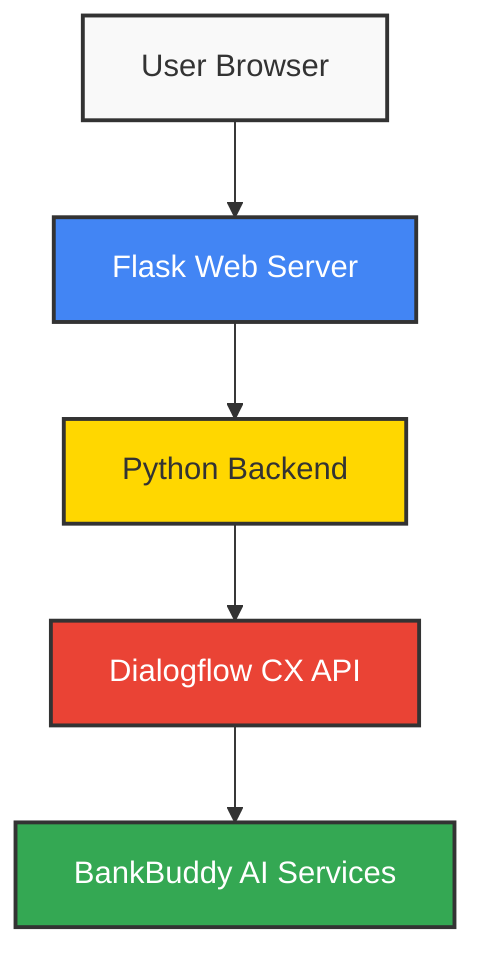

# 🏦 BankBuddyUI: Banking Chatbot Interface 🤖


## 📋 Overview

BankBuddyUI is a sleek, modern web interface for the BankBuddy banking chatbot. This project provides a user-friendly front-end that connects to Google's Dialogflow CX for natural language processing and conversation flow management, delivering an engaging banking assistant experience.

## ✨ Features

### 🌐 Web Interface
- **💬 Interactive Chat Window** - Real-time conversation with the banking assistant
- **🎨 Modern UI Design** - Clean, professional banking interface
- **📱 Responsive Layout** - Works on desktop, tablet, and mobile devices

### 🔌 Backend Integration
- **🧠 Dialogflow CX Connection** - Seamless integration with Google's advanced NLP
- **🔄 Session Management** - Maintains conversation context for each user
- **🌍 Multi-language Support** - Ready for internationalization

### 🚀 Deployment
- **🐳 Docker Support** - Easy containerization for deployment
- **☁️ Cloud Ready** - Designed for cloud environments
- **🔧 Configurable** - Simple setup for different environments

## 🛠️ Technology Stack



| Component | Description | Technology |
|-----------|-------------|------------|
| **Frontend** | User interface for chat interaction | HTML, CSS, JavaScript |
| **Web Server** | Handles HTTP requests and serves the application | Flask 3.0.0 |
| **Backend** | Processes requests and communicates with Dialogflow | Python 3.9 |
| **NLP Engine** | Natural language processing and conversation management | Google Dialogflow CX |
| **Deployment** | Application containerization | Docker |

## 🚀 Getting Started

### Prerequisites
- Python 3.9+
- Google Cloud account with Dialogflow CX enabled
- Google Cloud credentials for Dialogflow

### Installation

1. **Clone the repository**
   ```bash
   git clone https://github.com/Yash-Kavaiya/BankBuddyUI.git
   cd BankBuddyUI
   ```

2. **Set up a Python virtual environment (optional but recommended)**
   ```bash
   python -m venv venv
   source venv/bin/activate  # On Windows, use: venv\Scripts\activate
   ```

3. **Install dependencies**
   ```bash
   pip install -r requirements.txt
   ```

4. **Configure Google Cloud credentials**
   ```bash
   # Set environment variable for authentication
   export GOOGLE_APPLICATION_CREDENTIALS="/path/to/your-credentials.json"
   
   # On Windows PowerShell
   $env:GOOGLE_APPLICATION_CREDENTIALS="C:\path\to\your-credentials.json"
   ```

5. **Update Dialogflow settings**
   
   Edit `dialogflow_api.py` and update:
   - Project ID
   - Agent ID
   - Location

### Running the Application

**Run locally:**
```bash
python main.py
```

The application will be available at http://localhost:8080

### Docker Deployment

1. **Build the Docker image**
   ```bash
   docker build -t bankbuddy-ui .
   ```

2. **Run the container**
   ```bash
   docker run -p 8080:8080 -e GOOGLE_APPLICATION_CREDENTIALS="/app/credentials.json" -v /path/to/credentials.json:/app/credentials.json bankbuddy-ui
   ```

## 💻 Project Structure

```
BankBuddyUI/
├── templates/               # HTML templates for the web interface
│   ├── css/                 # Stylesheet files
│   ├── js/                  # JavaScript files
│   └── index.html           # Main chat interface
├── main.py                  # Flask application entry point
├── dialogflow_api.py        # Dialogflow CX integration logic
├── requirements.txt         # Python dependencies
├── Dockerfile               # Docker configuration
└── README.md                # Project documentation
```

## 🔧 Configuration

### Dialogflow Settings

The Dialogflow connection is configured in `dialogflow_api.py`:

```python
project_id = "your-project-id"
location_id = "global"  # Or your specific region
agent_id = "your-agent-id"
language_code = "en-us"  # Default language
```

### Flask Settings

The Flask server configuration is in `main.py`:

```python
# Port configuration
port = int(os.environ.get("PORT", 8080))

# Debug mode (disable in production)
debug = True  # Set to False for production
```

## 🔄 API Endpoints

| Endpoint | Method | Description |
|----------|--------|-------------|
| `/` | GET | Serves the main chat interface |
| `/fetch_message` | POST | Processes user messages and returns bot responses |

## 🌟 Future Enhancements

- 🔐 User authentication integration
- 📊 Analytics dashboard for conversation insights
- 🎮 Interactive UI components for banking operations
- 🚨 Advanced error handling and fallback mechanisms
- 📱 Native mobile applications

## 🤝 Contributing

Contributions are welcome! Please feel free to submit a Pull Request.

## 📝 License

This project is proprietary software owned by Yash Kavaiya.

---

⭐ Star this repository if you find it useful!

📝 For issues and feature requests, please create a new issue.

🏆 Developed by [Yash Kavaiya](https://github.com/Yash-Kavaiya)
